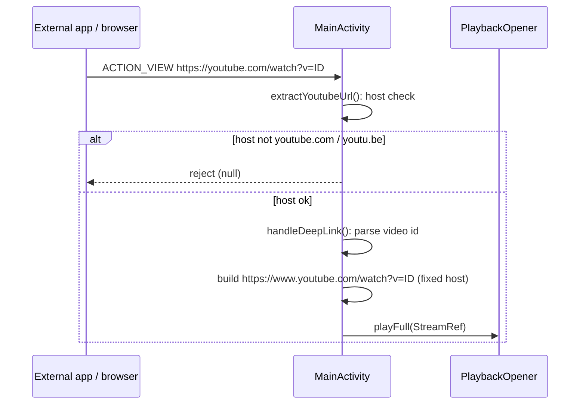
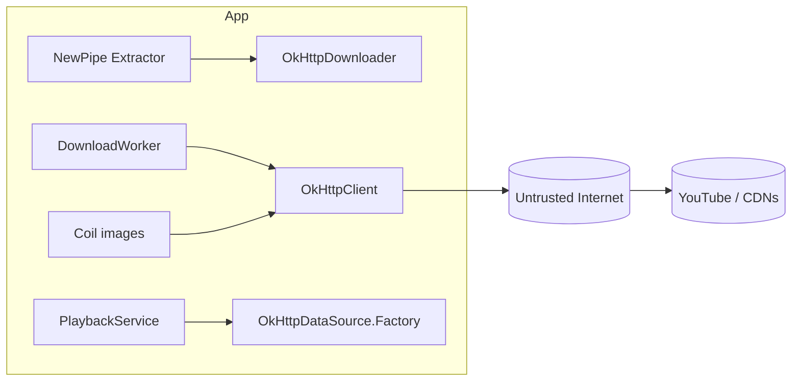
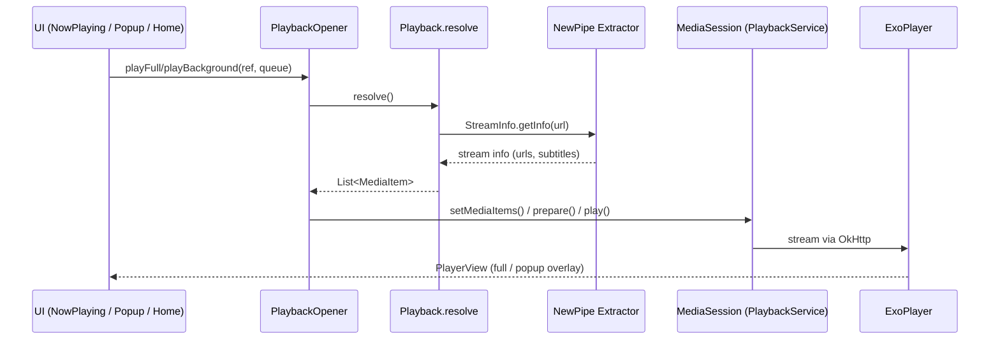
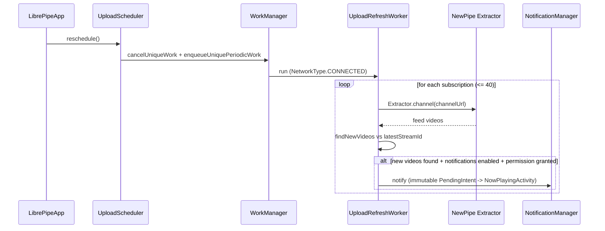
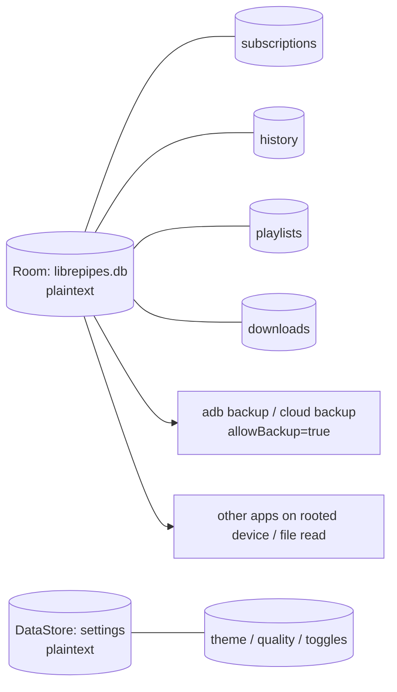

# LibrePipe — Security Flows

Security walkthrough of the LibrePipe Android app (`app.librepipes`).
LibrePipe is a privacy-focused, ad-free YouTube & YouTube Music client with **no
login, no Google Play Services, and no accounts**. This document maps every
security-relevant flow from entry point to storage/network exit, with
`file:line` references and diagrams.

> Note: all line numbers refer to files under
> `app/src/main/java/app/librepipes/` at the time of writing.

---

## Table of contents

- [Threat model](#threat-model)
- [Assets](#assets)
- [1. Deep-link / external intent flow](#1-deep-link--external-intent-flow)
- [2. Network & transport flow](#2-network--transport-flow)
- [3. Playback flow](#3-playback-flow)
- [4. Download flow](#4-download-flow)
- [5. Upload notification flow](#5-upload-notification-flow)
- [6. Permissions & foreground services](#6-permissions--foreground-services)
- [7. Data at rest](#7-data-at-rest)
- [Findings & risks](#findings--risks)

---

## Threat model

| Assumption | Detail |
|---|---|
| Trust boundary | The OS is trusted; the network is not. Media/content is **untrusted**. |
| No accounts | No auth, tokens, or server-side API. Nothing to compromise remotely. |
| Content ingestion | Video/audio/channel data comes from YouTube via the NewPipe Extractor and is **attacker-influenced** (any channel can publish). |
| Local device | Data lives only on-device: Room DB, DataStore, cache, MediaStore. |
| Malicious apps | Other installed apps are untrusted (intents, exported components, media session). |

Primary threats considered:

- **Malicious/redirected content URLs** (extractor stream URLs, subtitle URLs, image URLs).
- **Data exfiltration** of the plaintext local database via backup (`adb`/cloud) or other apps.
- **Screen capture / recording** of the floating popup player or the full-screen player.
- **Abuse of exported components** (MediaSessionService, deep-link intent filters).
- **Cleartext traffic** to `http://` endpoints.
- **Injection / tampering** of the local database or downloaded files.

---

## Assets

| Asset | Location | Format | Notes |
|---|---|---|---|
| Subscriptions | Room DB `librepipes.db` | SQLite, plaintext | `Entities.kt:8-19`, `AppDatabase.kt` |
| Watch history | Room DB | SQLite, plaintext | `Entities.kt:38-45` |
| Local playlists | Room DB | SQLite, plaintext | `Entities.kt:47-61` |
| Download metadata | Room DB | SQLite, plaintext | `Entities.kt:63-74` |
| User settings | DataStore `settings` | plaintext prefs | `SettingsRepository.kt:12` |
| Downloads | MediaStore `Downloads/LibrePipe` (API 29+) / external public dir (API 26-28) | media files | `DownloadWorker.kt:348-376` |
| Temp media | app cache `cache/downloads` | media files | `DownloadWorker.kt:126` |

No encryption is used for any asset at rest.

---

## 1. Deep-link / external intent flow

**Entry:** `MainActivity` declares `android.intent.action.VIEW` intent filters for
`https://` / `http://` hosts `youtube.com`, `m.youtube.com`, `youtu.be`,
`music.youtube.com` — `AndroidManifest.xml:37-58`.

**Handlers:**

1. `MainActivity.extractYoutubeUrl()` — `MainActivity.kt:136-145`
   - Requires `intent.action == ACTION_VIEW`.
   - Accepts only intents whose **host** `contains("youtube.com") || contains("youtu.be")`.
   - Rejects everything else (returns `null`).
2. `handleDeepLink()` — `MainActivity.kt:330-367`
   - Parses the URL and extracts a video id from `/watch?v=`, `/shorts/`, `/live/`,
     or `youtu.be/<id>`.
   - **Never uses the untrusted URL for fetching.** A synthetic, hardcoded
     `https://www.youtube.com/watch?v=$videoId` is built (`MainActivity.kt:352`)
     and handed to `PlaybackOpener.playFull()`.
   - Non-video links navigate to channel/playlist routes with the raw URL as a
     nav argument (used only to construct an extractor request).

**Validation summary:** host gating + id parsing. Because the fetch URL is
reconstructed against a fixed trusted host, there is **no SSRF** vector through
this entry point even if a malicious app forges an intent.



**Risks:**
- `contains("youtube.com")` is a substring match — a host like
  `youtube.com.evil.example` would pass the check. Impact is limited because the
  fetch URL is hardcoded to the real domain (see above), but the channel/playlist
  route branch passes the attacker URL into the extractor, which parses YouTube
  URLs — low risk.
- `http://` hosts are accepted (`AndroidManifest.xml:52-57`). The reconstructed
  playback URL is always `https`, so the cleartext filter is effectively inert.
- `MainActivity` is `exported="true"` with `launchMode="singleTask"`; all external
  input funnels through the validated path above.

---

## 2. Network & transport flow

**Client:** single shared `OkHttpClient` — `AppContainer.kt:26-34`.

```kotlin
OkHttpClient.Builder()
    .connectTimeout(20, SECONDS)
    .readTimeout(60, SECONDS)
    .writeTimeout(60, SECONDS)
    .followRedirects(true)         // follows HTTP(S) redirects
    .retryOnConnectionFailure(true)
    .build()
```

**Users of the client:**
- `OkHttpDownloader` (NewPipe Extractor bridge) — `data/extractor/OkHttpDownloader.kt:14-61`
- `DownloadWorker` stream fetches — `DownloadWorker.kt:242,297`
- `PlaybackService` ExoPlayer `OkHttpDataSource.Factory` — `PlaybackService.kt:34-41`
- Coil image loading (`coil.network.okhttp`).

**Properties of note:**
- **No certificate pinning** — standard system trust store only.
- **No cleartext config** — no `networkSecurityConfig`, and the manifest does not
  set `android:usesCleartextTraffic`. With `targetSdk = 36`, cleartext HTTP is
  **blocked by default** by the platform; the `http://` deep-link filters in
  Section 1 are therefore effectively unusable for actual network traffic.
- **Redirects are followed** — `followRedirects(true)`. Media stream requests
  (video/audio/subtitles) can land on CDN domains after redirects; this is
  expected for YouTube streams but means the effective request target is whatever
  the untrusted content host redirects to.
- Default OkHttp **no cookie jar, no auth**, so no credential leakage; YouTube
  streaming is authenticated via signed URLs embedded in the extracted stream URL.



**Risks:**
- No certificate pinning — an attacker who can install a root CA on the device
  (malware/user action) can MITM all traffic.
- Redirect chains allow a compromised video host to serve arbitrary bytes into
  playback/download buffers (they are already treated as untrusted media).

---

## 3. Playback flow

**Components:**
- `PlaybackService` — exported `MediaSessionService` hosting one ExoPlayer instance — `PlaybackService.kt:18-62`
- `PlaybackOpener` — connects to the session, queues media — `PlaybackOpener.kt:15-83`
- `Playback.resolve/buildItem` — resolves URLs, builds `MediaItem`s + subtitles — `Playback.kt:37-168`
- `NowPlayingActivity` — full-screen UI (not exported) — `NowPlayingActivity.kt:89-144`
- `PopupPlayerService` — floating overlay (not exported) — `PopupPlayerService.kt:35-228`
- `HistoryTracker` — writes watch history from the session — `player/History.kt:15-49`

**Flow:** `PlaybackOpener.playFull/playBackground` → `Playback.resolve()` calls
`Extractor.stream(url)` (NewPipe `StreamInfo.getInfo`) → picks audio/progressive/DASH/HLS
URL or `.dashMpdUrl` → builds a `MediaItem` with title/artist/artwork extras
(`Playback.kt:71-97`) → MediaController sets items on the `MediaSession` → ExoPlayer
streams via OkHttp.

**Subtitle handling** (`Playback.kt:143-168`): subtitle URLs come from the
extractor, MIME type is whitelisted (`vtt`/`srt`/`ttml`), otherwise skipped.

**Media session exposure:** `PlaybackService` is `exported="true"` and
`onGetSession()` returns the session unconditionally for any caller —
`PlaybackService.kt:47-48`. A malicious app can connect to the media session to
read the queue/playback state or issue control commands (play/pause/seek).



**Risks:**
- **Unvalidated media-session controllers** — exported `MediaSessionService`
  allows any app to control playback and read queue metadata.
- **Untrusted stream bytes** are parsed by platform codecs (ExoPlayer). Standard
  media-parser exposure; mitigated by platform hardening, not by this app.
- **Screen capture** — neither `NowPlayingActivity` nor `PopupPlayerService`
  sets `FLAG_SECURE`, so playback can be screen-recorded by other apps.
- **History privacy** — playback positions + stream metadata are persisted
  whenever `recordHistory` is on (`History.kt:21-27`, default `true`).

---

## 4. Download flow

**Entry points:**
- Now-playing download button — `NowPlayingActivity.kt:336-344`
- `DownloadManager.enqueue()` — `download/DownloadManager.kt:22-42`

**Pipeline (`DownloadWorker.doWork` → `download`)** — `DownloadWorker.kt:42-96,104-155`:

1. Insert `DownloadEntity` into Room (`DownloadRepository.kt:16-28`).
2. Enqueue `OneTimeWorkRequest` keyed `"download-$id"` with `NetworkType.CONNECTED`
   constraint (`DownloadManager.kt:29-41`).
3. Worker extracts stream info via `Extractor.stream()`.
4. `selectStreams()` chooses progressive MP4, or video-only + audio-only to mux —
   `DownloadWorker.kt:163-204`.
5. Fetches to cache temp files (`fetchToFile`) or straight to storage
   (`writeToStorage`), streaming with a 256 KiB buffer; respects `isStopped` for
   cancellation — `DownloadWorker.kt:229-273,285-326`.
6. Two-stream case: `MediaMuxerKit.mux()` (platform `MediaMuxer`, MP4/WebM) then
   copy to MediaStore — `DownloadWorker.kt:140-149`, `MediaMuxerKit.kt:18-37`.
7. Writes via MediaStore with `IS_PENDING=1` on API 29+, or to
   `Downloads/LibrePipe` public dir on API 26-28 — `DownloadWorker.kt:348-376`.
8. Progress notifications throttled (`percent % 10`) — `DownloadWorker.kt:275-283`.

**Filename sanitization:** `streamFileName()` strips everything outside
`[A-Za-z0-9 _.-]`, caps at 80 chars, falls back to the stream id —
`DownloadWorker.kt:215-226`. Prevents path traversal via title.

**MIME/extension selection** is derived from the extracted stream format, not user
input — `DownloadWorker.kt:389-395`.

```mermaid
flowchart TD
    UI[NowPlaying: Download] --> DM[DownloadManager.enqueue]
    DM --> ROOM[(Room: downloads)]
    DM --> WM[WorkManager OneTimeWork<br/>NetworkType.CONNECTED]
    WM --> W[DownloadWorker.doWork]
    W --> EX[Extractor.stream ref.url]
    EX --> SEL[selectStreams<br/>progressive | video+audio]
    SEL --> FETCH[fetchToFile -> cache .tmp]
    SEL --> WRITE[writeToStorage -> MediaStore IS_PENDING]
    FETCH --> MUX[MediaMuxerKit.mux MP4/WebM]
    MUX --> COPY[copyFileToStorage]
    COPY --> MS[(MediaStore Downloads/LibrePipe)]
    WRITE --> MS
    W --> UP[Update state DONE / fileUri]
```

**Risks:**
- **Arbitrary URL fetch:** stream URLs come from the extractor (untrusted content).
  The worker fetches whatever URL the extractor returns after redirects
  (`DownloadWorker.kt:242,297`). Response is only ever written to storage — no
  HTML/JS execution — but disk-space exhaustion or serving malicious media is
  possible.
- **Temp files** in cache are cleaned on success/failure (`DownloadWorker.kt:146-148`),
  but an interrupted worker may leave `.tmp` files in the app cache (tied to app
  storage, inaccessible to other apps without root).
- **Filename sanitization** only runs on the video title; MediaStore-provided
  `DISPLAY_NAME` is safe. Older API path (`Uri.fromFile`) uses the same sanitized name.
- Content length is used for progress; a lying or chunked server still yields a
  complete file (bytes verified only by codec, not checksum).

---

## 5. Upload notification flow

**Components:**
- `UploadScheduler` — (re)schedules periodic work from settings — `notify/UploadScheduler.kt:13-37`
- `UploadRefreshWorker` — checks subscriptions, posts notifications — `notify/UploadRefreshWorker.kt:23-121`
- `NotificationChannels` — creates channels — `notify/NotificationChannels.kt:9-41`

**Flow:**
1. `LibrePipeApp.onCreate` calls `UploadScheduler.reschedule()` — `LibrePipeApp.kt:22`.
2. Scheduler cancels previous work, then (if `notificationsEnabled`) enqueues a
   `PeriodicWorkRequest<UploadRefreshWorker>` with `NetworkType.CONNECTED` and a
   unique name — `UploadScheduler.kt:20-36`.
3. Worker iterates up to 40 subscriptions, fetches each channel feed via the
   extractor, diffs against `latestStreamId` (`findNewVideos`), and posts grouped
   notifications — `UploadRefreshWorker.kt:35-58,60-69`.
4. Notifications carry a `PendingIntent` (immutable, `FLAG_UPDATE_CURRENT`) into
   `NowPlayingActivity` with the video `StreamRef` JSON — `UploadRefreshWorker.kt:83-92`.
5. Permission is re-checked before posting (`POST_NOTIFICATIONS`) — `UploadRefreshWorker.kt:76-80`.
6. Failed channel fetches cause `Result.retry()` (backoff) — `UploadRefreshWorker.kt:56-57`.



**Risks:**
- **Notification content injection:** video titles come from the extractor
  (untrusted). They are displayed in notifications as-is (`UploadRefreshWorker.kt:98-100`).
- Notification `requestCode` uses `video.id.hashCode()` / `channelId.hashCode()`
  — hash collisions could reuse request codes (low impact with `FLAG_IMMUTABLE`).
- The worker performs network calls in a background WorkManager process — no UI
  exposure, but channel URLs are fetched from the DB which itself is populated
  from search/extraction results.

---

## 6. Permissions & foreground services

**Declared permissions** — `AndroidManifest.xml:5-16`:

| Permission | Purpose | Threat |
|---|---|---|
| `INTERNET` | all network | — |
| `ACCESS_NETWORK_STATE` | WorkManager constraints | — |
| `WAKE_LOCK` | playback keep-awake | — |
| `POST_NOTIFICATIONS` | notifications (runtime, requested via `MainActivity.kt:130-134`) | — |
| `SYSTEM_ALERT_WINDOW` | popup player overlay | High-privilege; granted via settings screen (`PopupLauncher`, `NowPlayingActivity.kt:515-545`) |
| `FOREGROUND_SERVICE` + `FOREGROUND_SERVICE_MEDIA_PLAYBACK` / `_DATA_SYNC` | background playback, upload checks, downloads | FGS-type compliance |
| `WRITE_EXTERNAL_STORAGE` (maxSdk 28) | legacy download path | None on modern devices |

**Component exposure:**

| Component | Exported | Notes |
|---|---|---|
| `MainActivity` | true | launcher + deep links (see Section 1) |
| `NowPlayingActivity` | false | internal |
| `PlaybackService` | true | Media3 `MediaSessionService`; `onGetSession` returns session unconditionally |
| `PopupPlayerService` | false | overlay, overlay permission gate before start |

**Overlay gate:** `PopupLauncher.requestAndStart` checks
`Settings.canDrawOverlays()` before starting `PopupPlayerService`; if not granted,
it launches the OS overlay-permission settings page and defers until
`consumePending` on resume — `NowPlayingActivity.kt:511-545`.

**Risks:**
- `SYSTEM_ALERT_WINDOW` is one of the most sensitive runtime settings — the app
  holds the granted flag and uses it to render a draggable/resizable overlay.
- Exported `PlaybackService` (Section 3) is the only externally reachable
  component besides the deep-link activity.

---

## 7. Data at rest

**Database** — `AppDatabase.kt:8-35`:
- Plaintext SQLite via Room, database name `librepipes.db`.
- `fallbackToDestructiveMigration()` — schema upgrades wipe data rather than risk
  corrupted migrations.
- `exportSchema = false` — schema not exported for review.

**Manifest backup:** `android:allowBackup="true"` — `AndroidManifest.xml:20`.
On Android 12+ device-to-device transfer / cloud backups will copy the plaintext
DB, DataStore, and app cache to Google/other devices. No `dataExtractionRules`
to exclude it.

**Settings** — DataStore preferences, plaintext (`SettingsRepository.kt:12`).

**What is stored:** subscription list, full `StreamRef` JSON (titles, URLs,
thumbnails, uploader) for history/playlists/downloads, playback positions,
download URIs/state. No credentials (there are none).



**Risks:**
- **No encryption at rest** for any stored data.
- **`allowBackup=true`** without exclusions enables extraction of the full
  database via `adb backup` (API 26-30) or device-transfer (API 31+).
- **Destructive migrations** are a reliability/privacy trade-off: predictable
  wipe, but a downgrade or corruption path could silently erase user data.

---

## Findings & risks

| # | Finding | Location | Risk | Status / Mitigation |
|---|---|---|---|---|
| 1 | No certificate pinning | `AppContainer.kt:26-34` | Medium (device with rogue CA) | Accepted — standard for NewPipe-based clients |
| 2 | Unencrypted Room DB + `allowBackup=true` | `AppDatabase.kt`, `AndroidManifest.xml:20` | High (data extraction via backup) | Open — consider encryption (SQLCipher) and `dataExtractionRules` excluding sensitive data |
| 3 | `MediaSessionService` exported, session returned unconditionally | `PlaybackService.kt:47-48`, `AndroidManifest.xml:73-79` | Low/Medium (malicious app controls playback / reads queue) | Open — validate `ControllerInfo` / connection policy |
| 4 | Deep-link host check uses `contains()` | `MainActivity.kt:140` | Low (host suffix spoofing) | Open — use exact host matching |
| 5 | `http://` deep-link hosts accepted | `AndroidManifest.xml:52-57` | Low (cleartext) | Inert in practice (reconstructed URLs are https; cleartext blocked on targetSdk 36) |
| 6 | Untrusted media/subtitle/thumbnail URLs fetched | `Playback.kt:143-168`, `DownloadWorker.kt:242,297` | Low/Medium (malicious content) | Accepted — treated as untrusted media; MIME whitelist for subtitles |
| 7 | No `FLAG_SECURE` on players | `NowPlayingActivity.kt:229-263`, `PopupPlayerService.kt:100-112` | Medium (screen capture of content) | Open — set `FLAG_SECURE` for content windows |
| 8 | Notification titles from extractor rendered raw | `UploadRefreshWorker.kt:98-100` | Low (spoofed content in notification) | Accepted — display-only |
| 9 | Temp files may linger in cache on interrupt | `DownloadWorker.kt:126-149` | Low | Accepted — confined to app cache |
| 10 | `SYSTEM_ALERT_WINDOW` overlay used | `NowPlayingActivity.kt:511-545` | Medium (privilege) | Gated behind user-granted `canDrawOverlays` check |
| 11 | No checksum/verify of downloaded bytes | `DownloadWorker.kt:250-265` | Low (corrupt/lie server) | Accepted — platform codecs validate at playback |
| 12 | PendingIntent request codes via `hashCode()` | `UploadRefreshWorker.kt:90,118` | Low (collision) | Mitigated by `FLAG_IMMUTABLE` |

**Summary:** LibrePipe's externally reachable surface is intentionally small
(one exported activity for deep links, one exported media session service, no
network-facing server, no credentials). The highest-value hardening targets are
**data at rest** (#2), **media-session access control** (#3), and **screen-capture
protection** (#7). The content-handling flows are architecturally sound: untrusted
URLs never drive the fetch target for deep links (fixed host), file names are
sanitized, and everything fetched is treated as untrusted media.
